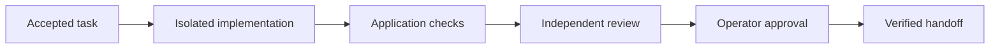

# Software & Defence Factory

A portable method and a local runtime for taking a scoped software task through implementation, checks, independent review and an explicit handoff.

Developed by [Arcitai](https://github.com/arcitai). The CLI is **software-defence-factory**. It works with existing repositories, Codex, Pi or a configured executor. No personal context system is required.

## Start here

Install the published [npm package](https://www.npmjs.com/package/software-defence-factory). The CLI includes the dashboard; no source checkout is needed.

```sh
npm install --global software-defence-factory
software-defence-factory help
```

For occasional use: `npx software-defence-factory@latest help`.

Choose the part you need:

| Outcome | Command / guide |
| --- | --- |
| Set up an operator, worker and application | [Setup plan and acceptance checklist](docs/setup.md) |
| Use the method with your existing agent | `software-defence-factory kit --output ./factory-kit` — exports a new staging directory |
| Try the runtime without inference | `software-defence-factory demo` — Docker required; synthetic sample only |
| Connect an existing repository | [Runtime quickstart](docs/quickstart.md) |
| Understand installation and updates | [npm and npx](docs/npm.md) |
| Restore a dashboard after boot or reconnect remotely | [Services and SSH tunnels](docs/services.md) |
| Review the evidence and limits | [Qualification](docs/proof.md) |

The runtime supplies policy and six focused skills to its isolated jobs. `init` configures a private installation; it does not modify the application or start work. Model access and the application's real check command must be configured before using it for delivery.

## How work moves



Each result belongs to a specific candidate commit and policy. A failed check blocks delivery. Changing the candidate or check policy invalidates earlier evidence. Approval records a handoff; publishing, merging and deployment follow the application's separate authority.

The per-project dashboard keeps Software and Defence in one searchable task list, with workflow/model/status filters, a board, task details, files and history. Analytics separates workflows and shows recorded duration and token usage with explicit coverage; missing billing amounts stay unknown. View repo and New issue use the configured GitHub origin. Start work opens a modal to import/review an issue or write a scoped brief; it never automatically starts work from a new issue. See [workflows and skills](docs/workflows.md). Workers show detected host identity and capacity. Workflows show the actual phases, six packaged skills and selected configuration, shared with the `workflows` CLI command. It binds to localhost and can be reached remotely through SSH. One controller executes one job phase at a time; each job has its own checkout and bounded Docker containers.

The optional **defence** workflow accepts scoped incident evidence and produces a private, read-only draft. It does not monitor production or claim verified recovery. See [defence integration](docs/defence-integration.md).

## Repository map

| Directory | Responsibility |
| --- | --- |
| `bin/` | CLI entry point |
| `factory/` | Queue, HTTP API, isolation, evidence, updates and bundled dashboard assets |
| `dashboard/` | Dashboard source and UI tests |
| `kit/`, `.agents/skills/` | Portable method, adoption records and six skills |
| `scripts/`, `tests/` | Packaging, qualification, release checks and behavioral tests |
| `docs/` | Setup, architecture, recovery, proof and ownership |

The current runtime replaces earlier prototypes. Their source and research remain in Git history; they are not part of the installed package.

## Contribute

Requires Node 22.13+, npm and Git. Docker is needed only for integration qualification.

```sh
npm ci --ignore-scripts
npm run build:dashboard
npm run check
```

CI builds the dashboard and checks Node 22/24. A version increase merged to `main` is published to npm through the configured release workflow. Installed CLIs can update on invocation when all installations are stopped. See [release and update behavior](docs/npm.md).
Managed Linux services can also opt into daily updates that reserve idle controllers, preserve stopped projects and restore the prior release if startup fails. See [service operation](docs/services.md).

This is a test release. Synthetic qualification demonstrates control flow and isolation, not model quality, application correctness or production readiness. Follow [AGENTS.md](AGENTS.md) for contributions and [SECURITY.md](SECURITY.md) for the trust boundaries.

MIT for original code and method. Included dashboard components and fonts retain their licenses in [third-party notices](THIRD_PARTY_NOTICES.md).

## Contributing

See [CONTRIBUTING.md](CONTRIBUTING.md) for source setup and checks, the
[self-development recipe](docs/development.md) for running project work through
Factory, and [todo.md](todo.md) for the ordered issue backlog.
