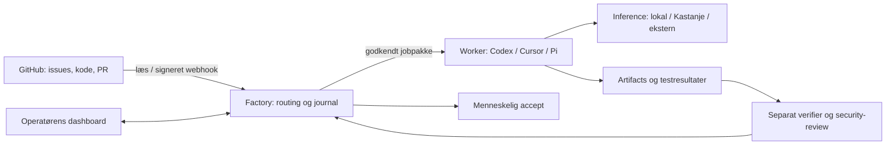

# Software and Security Factory: to arbejdsspor

Software and Security Factory har én fælles kerne med et software-spor og et security-spor. Begge har opgaver, scopes, jobs, artifacts, review, målinger og menneskelig accept. Security-fund kan kræve strengere privat scope, anden model og separate verifikationsmiljøer. Det begrunder særskilte worker-profiler. Den separate **Defense Factory** har ansvar for løbende overvågning og fund fra drift, også for software bygget andre steder. Den kan aflevere afgrænsede rettelsesopgaver hertil; [produktgrænse og overdragelse](adoption.md#produktnavn-og-grænsen-til-defense-factory).

## Lag og filer

| Ansvar | Kilde | Grænse |
| --- | --- | --- |
| Business outcome og accept | GitHub-issue + lokal accepteret specifikation | GitHub-label alene kan ikke godkende manglende specifikation |
| Metode | AGENTS.md og `.agents/skills` | Tekst giver hverken browser, sandbox eller adgang |
| Routing og tilstand | `src/domain.mjs`, `src/store.mjs` | Servervalideret scope og optimistic revision |
| GitHub-spejl | `src/github.mjs` | Read-only REST; åbne issues/PR’er, højst 100 af hver; webhooks for udvalgte issue-events |
| Harness | `src/jobs.mjs`, `scripts/run-job.mjs`, profiler | Codex CLI-, Pi RPC- og Security SDK-adaptere; cloud-job eksporteres til separat afvikling |
| Inference | Profilens provider | Kan skiftes uden ny workflow-metode; kvalitet/kompatibilitet følger ikke automatisk med |
| Beviser og værdi | Evidensimport + eval-import | Operatørbetroet input; formatkontrol er ikke kryptografisk attestation |
| UI | `public/` | Ingen tokens, shells eller provider-kald fra browseren |

## Tilstandsmaskine

Indbakke → specifikation → godkendt/klar → forberedt → kører → review → accepteret. Blokeret er en synlig tilstand. Et *forberedt* job bruger ingen model. *Afsluttet proces* betyder ikke *bestået opgave*. Ukendt processtatus holder writer-låsen, indtil operatøren har afstemt den.

Godkendelsen hasher repository, titel, body, acceptkriterier, profil og capabilities. GitHub-redigering invaliderer godkendelse og annullerer forberedte jobs; aktive jobs får stopanmodning. Checks knyttes til fuld commit-SHA og korrekt forsøg/scope. Review eller scopeændring kan føre til en reparation. Maksimalt første afviklede forsøg plus to reparationer; planlæg derefter arbejdet på ny. Forberedte jobs annulleret før start tæller ikke som afviklet forsøg.

Accepteret betyder operatørens lokale accept. Det er hverken GitHub-merge, deployment eller garanti for sårbarhedsfri kode.

## Den lille deployment

Én Node-proces, SQLite på lokalt persistent disk, statiske webfiler og CLI-worker. Ingen køtjeneste, Redis, Kubernetes, Actions eller browser-framework. Kør lokalt eller på egen VM og tilgå via SSH-portforward. Den lokale worker og controller deler filesystem/journal i denne version; det er **ikke** en distribueret worker-protokol. Brug et dedikeret miljø uden private brugerdata, særskilt checkout og sandbox. Kør kun ét kundescope i denne installation.

En fjern worker kan få en eksporteret jobpakke og aflevere beviser til operatøren. SQLite må ikke deles som netværksfilesystem mellem maskiner. Næste runtime-version skal have autentificeret jobclaim, lease/heartbeat, immutable artifacts og servervalideret verifier-identitet, før flere workers/multi-tenant brug.

## Hvad v0.1 ikke gør endnu

- Ingen scheduler starter modeller ubemandet; jobs overdrages eksplicit via CLI eller cloudprofil. Webhooks opdaterer køen, ikke en betalt runtime.
- Ingen fuld tovejssynkronisering. PR-checks og head-opdateringer læses på GitHub og importeres til opgaven; vi påstår ikke, at et lokalt evidens-head er platformens nyeste head. Kontrollér igen ved reel merge.
- Ingen automatisk indlæsning af providerfakturaer. Omkostninger indføres af operatøren og markeres ukendt/estimeret/faktisk. Tidsgrænse er implementeret; finansielt hard cap kræver providerens budgetkontrol eller næste adapter.
- Ingen aktiv kundescanning, automatisk udgivelse, telefonadgang eller offentlig webservice. Appen er loopback-only, uden multi-user login.

Udvid først det, pilotens målinger begrunder. Lad adaptere eje provider-specific API/state, og behold domænet og metrics uafhængige.

Efter gennemgangen af seks konkrete factory-videoer er [næste runtime](next-runtime.md) specificeret separat. Den dækker genbrug af en eksisterende motor, miljølivscyklus, krævede checks, risikobestemt review, budgetter og feedback fra drift/Defense Factory efter release. Dette dokument beskriver fortsat kun v0.1; de nye kontrakter er ikke automatisk implementeret ved at være skrevet ned.
