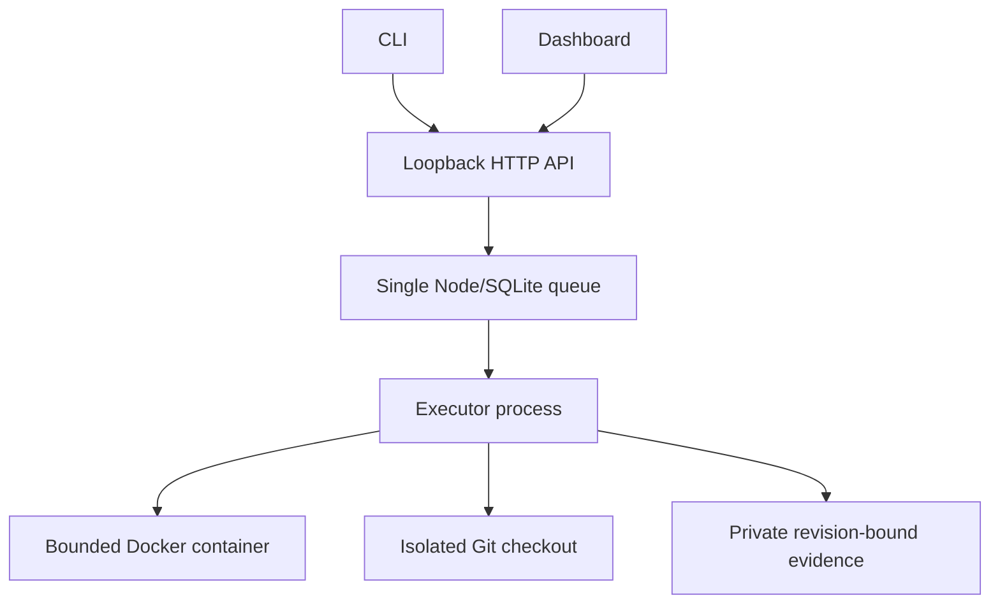

# Architecture

The package has two independently useful parts: a portable method and a local runtime. An application can adopt the method with its existing agent and CI without running this controller.

## Runtime

`factory/queue.mjs` owns state transitions and persists every attempt before execution. `server.mjs` adapts the queue and private artifacts to the dashboard. `processes.mjs` owns process groups, deadlines and reconciliation. `executor.mjs` creates the checkout, runs the selected agent and application checks, records review and validates handoff.

Software phases are build → verify → review → approved handoff. An implementation receives a writable job checkout; verification and review cannot modify that candidate. Both must cover the candidate commit and current policy hash. A requested revision preserves old work and starts a fresh implementation/check/review sequence. Retry resumes a stopped phase only after process/container reconciliation.

Defence is a separate read-only investigation workflow over admitted incident evidence. Both workflows use one execution owner; no competing scheduler exists. Automatic issue polling, live production connectors, arbitrary workflow editing and autonomous deployment are not implemented.

`dashboard/` preserves the selected task board, details, files, history, analytics, worker and workflow interaction model. Vite builds self-contained assets into `factory/ui/`; npm consumers need no frontend toolchain. The UI displays actual queue records, with unreported cost/tokens remaining unknown.

## Method and updates

`kit/` and `.agents/skills/` define triage, specification, implementation, review, security and evaluation. Runtime jobs receive them as read-only mounts. The export command stages a reviewable copy for an existing harness; it is not a global skill installer.

The npm CLI keeps runtime state outside node_modules. The updater installs immutable releases, validates package identity and activates only while registered controllers and executors are stopped. Container images stay pinned to their installed image IDs until an explicit reinstall. See [update behavior](npm.md).

Earlier experimental runtime and evaluation dashboards are retained in Git history at the pre-0.3 baseline, not shipped as competing implementations.
