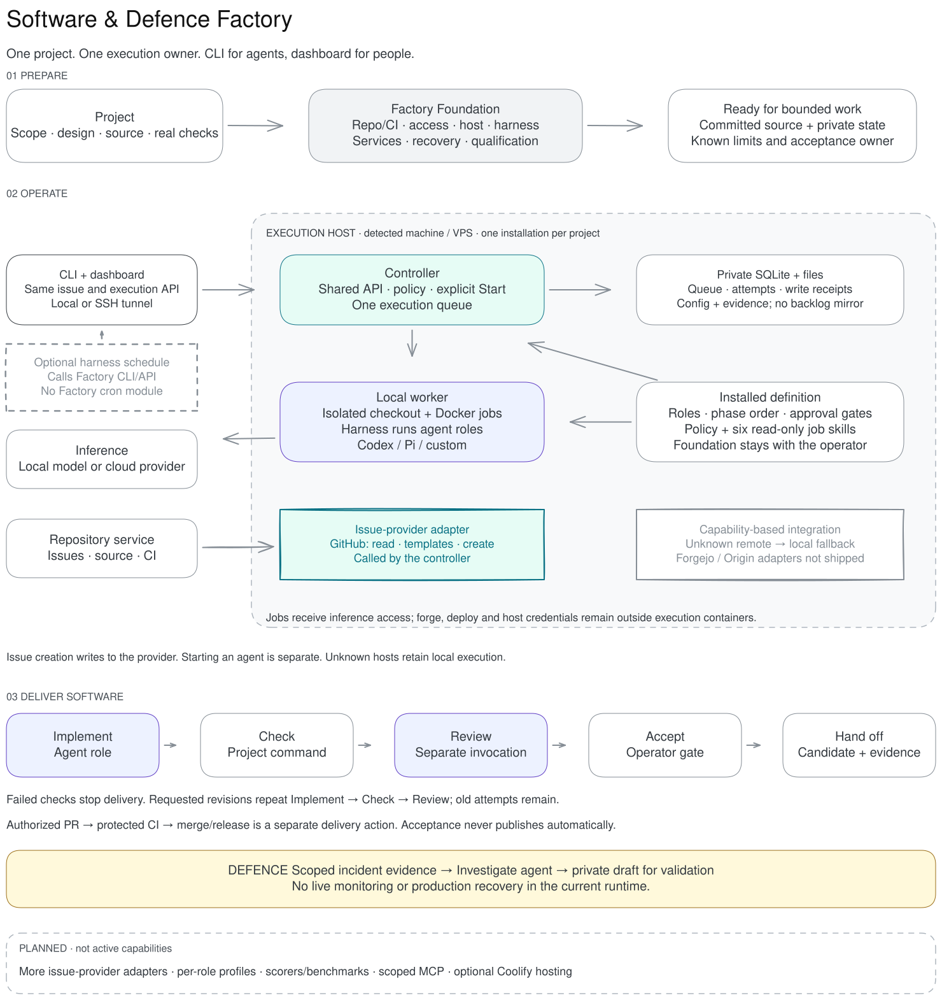

# Architecture

The package has two independently useful parts: a portable method and a local runtime. An application can adopt the method with its existing agent and CI without running this controller.

## Runtime

[Edit the Excalidraw source](architecture.excalidraw). The diagram separates
repository preparation, controller/host boundaries, software delivery and
Defence. Dashed planned capabilities are not installed behavior.

`factory/queue.mjs` owns state transitions and persists every attempt before execution. At admission, `source-admission.mjs` resolves the configured or explicit ref and retains its commit objects in a private per-job bare repository. The protected job record binds that repository identity, requested ref and resolved SHA; retries and revisions restore from those retained objects. `server.mjs` adapts the queue and private artifacts to the dashboard. `processes.mjs` owns process groups, deadlines and reconciliation. `executor.mjs` creates the checkout, runs roles through the selected harness and application checks, records review and validates handoff.

Software phases are build → verify → review → approved handoff. An implementation receives a writable job checkout; verification and review cannot modify that candidate. Both must cover the candidate commit and current policy hash. A requested revision preserves old work and starts a fresh implementation/check/review sequence. Retry resumes a stopped phase only after process/container reconciliation.

Defence is a separate read-only investigation workflow over admitted incident evidence. Both workflows use one execution owner; no competing scheduler exists. Schedules belong to the selected harness; Factory has no cron module or issue watcher. Live production connectors, arbitrary workflow editing and autonomous deployment are not implemented.

`dashboard/` preserves the selected task board, details, files, history, analytics, infrastructure, agents, skills and definition views. Vite builds self-contained assets into `factory/ui/`; npm consumers need no frontend toolchain. The UI displays actual queue records, with unreported cost/tokens remaining unknown.

## Repository integration

The [provider boundary](integrations.md) selects supported issue capabilities from
the Git origin. GitHub is the first adapter; unknown hosts retain local execution.
The CLI and dashboard call one controller API. Remote issues remain with their
provider; SQLite stores execution records and durable write receipts for recovery,
not a second issue backlog. Creating a remote issue never schedules execution.
The harness owns optional automations and calls the same API/CLI.

## Method and updates

`kit/` and `.agents/skills/` define triage, specification, implementation, review, security and evaluation. Runtime jobs receive them as read-only mounts. The export command stages a reviewable copy for an existing harness; it is not a global skill installer.

The npm CLI keeps runtime state outside node_modules. The updater installs immutable releases, validates package identity and activates only while registered controllers and executors are stopped. Container images stay pinned to their installed image IDs until an explicit reinstall. See [update behavior](npm.md).

Earlier experimental runtime and evaluation dashboards are retained in Git history at the pre-0.3 baseline, not shipped as competing implementations.

## Sources of truth

| Fact | Owner | Consumers |
| --- | --- | --- |
| Vocabulary | `factory/terminology.json` | Definition catalog, dashboard, CLI |
| Agent roles, skills and phase order | `factory/definition.mjs` | Queue, definitions API, CLI and UI |
| Instance settings | Private `factory.json` | Controller and immutable admitted attempt config |
| Job state, attempts and external write receipts | Private SQLite queue | CLI/API and dashboard |
| Admission-time repository identity, requested ref and commit | Protected job record plus per-job retained Git objects | Queue, executor, retry/revision, status and evidence |
| Remote issue metadata | Selected provider (GitHub adapter first) | Live adapter reads, CLI/API and dashboard |
| Automation schedule | Selected harness | Explicit calls into Factory CLI/API |
| List/board status groups | `dashboard/src/runs-board.js` | Both task views and their filters |
| Host details | `factory/machine.mjs` | Infrastructure API and dashboard |
| Job instructions | `.agents/skills/`, `kit/policy.md` | Read-only execution mounts and staged method export |
| Setup guidance | `operator-skills/factory-foundation/`, `docs/setup.md` | Explicit operator CLI/Skills view |

`workflows.mjs` is a compatibility re-export, not another definition. Stored
identifiers and compatibility API fields are documented in [concepts](concepts.md).
The removed prototype environment variables and inherited trigger renderer have
no live implementation. Planned features belong in issues, not dormant engines.
