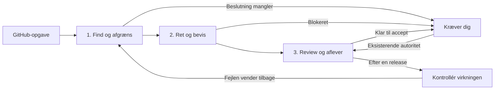

# BuilderIO: en mindre factory med bedre feedback

Gennemgået **23. september 2026**. Hele den engelske, automatisk genererede transskription til Steve (Builder.io)s [Build an agentic software factory: deep dive](https://www.youtube.com/watch?v=pNmfMi-yjZk), 17:34, er hentet og læst. Begge links i beskrivelsen er undersøgt: [skills](https://github.com/BuilderIO/skills) og [Agent-Native](https://github.com/BuilderIO/agent-native). Transskriptionen fejlskriver nogle navne; konkrete funktioner er kontrolleret mod repository-filer.

**Anbefaling: behold vores lille runner og brug BuilderIOs feedbackmetode til at kvalificere én pilot.** Start med GitHub, én worker og menneskelig accept. Reducér den synlige arbejdsgang til tre trin. Udvid først, når vi har set, hvor arbejdet faktisk stopper eller fejl vender tilbage. Dette dokument ændrer prioriteringen i [næste runtime](next-runtime.md); det tilføjer ikke automatisk drift.

## Hvad videoen bidrager med

| Tid | Steves pointe | Vores anvendelse |
| --- | --- | --- |
| [0:35](https://www.youtube.com/watch?v=pNmfMi-yjZk&t=35s) | Feedback → reproducerbar fejl → rettelse → verificeret PR. | Begynd med fejl, hvor før og efter kan efterprøves. |
| [4:24](https://www.youtube.com/watch?v=pNmfMi-yjZk&t=264s) | Følg review og checks til en konkret disposition. | En oprettet PR er et mellemtrin. |
| [6:16](https://www.youtube.com/watch?v=pNmfMi-yjZk&t=376s) | Hans testmiljø og loginbehov gør en ekstra lokal computer praktisk. | Dedikeret lokal worker er en relevant Z13-pilot. |
| [9:49](https://www.youtube.com/watch?v=pNmfMi-yjZk&t=589s) | Arbejde stopper undertiden før næste trin. | Registrér blokering og næste handling. |
| [10:24](https://www.youtube.com/watch?v=pNmfMi-yjZk&t=624s) | Gentagne fejl efter tidligere rettelser kræver bredere undersøgelse. | Lav et manuelt tilbageblik efter pilotleverancer. |
| [13:16](https://www.youtube.com/watch?v=pNmfMi-yjZk&t=796s) | Gode input, tests og adskilt beta/produktion hjælper. | Knyt fejl til version og testmiljø. |
| [14:27](https://www.youtube.com/watch?v=pNmfMi-yjZk&t=867s) | Start småt, manuelt og eventuelt med dry-run; automatisér senere. | Ingen ny scheduler som forudsætning for første pilot. |

Videoens udsagn om modelpris, produktivitet og antal PR’er er personlige erfaringer, ikke sammenlignelige Arcitai-benchmarks. Hans laptopvalg dokumenterer hans arbejdsgang; det beviser ikke, at cloud generelt er uegnet. Vi måler selv kvalitet, samlet forbrug og mennesketid. Bruges GPT-6 Luna, er Gustavs valgte reasoning **max**.

## Tre forskellige ting i kilderne

**1. Factory-skills er en metode.** Ved revision `9e4f7beb3def2d785a6fa347fd946fd1a063f522` indeholder [Factory-guiden](https://github.com/BuilderIO/skills/blob/9e4f7beb3def2d785a6fa347fd946fd1a063f522/docs/factory/README.md) en konfigurationsskill og otte workflows. Guiden kalder dem eksperimentelle. Den [fælles YAML](https://github.com/BuilderIO/skills/blob/9e4f7beb3def2d785a6fa347fd946fd1a063f522/docs/factory/configuration.md) er en agentlæst konvention uden parser/schema. Connectors, browser, credentials, scheduler og worktrees skal leveres af værten. En installeret skill gør derfor ikke Pi lige så komplet som et konfigureret desktopprodukt.

Der er en navneforskel at bevare: videoen bruger watchdog om både ekstra review og opfølgning. I den undersøgte kode er [agent-watchdog](https://github.com/BuilderIO/skills/blob/9e4f7beb3def2d785a6fa347fd946fd1a063f522/skills/agent-watchdog/SKILL.md) en selvstændig undersøgelse af en anden agents arbejde, mens [factory-watchdog](https://github.com/BuilderIO/skills/blob/9e4f7beb3def2d785a6fa347fd946fd1a063f522/skills/factory-watchdog/SKILL.md) finder stoppet leveringsarbejde. Flere watchdogs er ikke i sig selv bedre kvalitet.

**2. Agent-Native er et større app-framework.** Dets [fælles actions](https://github.com/BuilderIO/agent-native/blob/67cf8bbeca31c3c43b795cf5b9b89b60c011421f/packages/core/docs/content/actions-overview.mdx) lader UI, agent og API bruge samme operation. Det princip passer godt til factoryen. Vi kan videreføre det i egne domænefunktioner og adaptere uden at skifte til hele frameworket. Samme operation betyder stadig adgang efter rolle: implementeren skal ikke kunne godkende sin egen levering, blot fordi operatørens UI har en acceptknap.

**3. Agent-Native har også en konkret Factory-app.** Den undersøgte [template](https://github.com/BuilderIO/agent-native/blob/67cf8bbeca31c3c43b795cf5b9b89b60c011421f/templates/factory/README.md) omfatter Slack, GitHub, workspace-vault, Dispatch og PostgreSQL i produktion. [Pakkefilen](https://github.com/BuilderIO/agent-native/blob/67cf8bbeca31c3c43b795cf5b9b89b60c011421f/templates/factory/package.json) medfører bl.a. React, Vite og frameworkpakker. Den konkrete [dispatch-kode](https://github.com/BuilderIO/agent-native/blob/67cf8bbeca31c3c43b795cf5b9b89b60c011421f/templates/factory/actions/dispatch-factory-item.ts) har Builder-specifikke Slack-/bot-handoffs. Appen er relevant som reference, men en udskiftning af vores kerne kræver adapterarbejde og dokumenteret gevinst. Den er ikke afprøvet her.

## Vores tre trin

Trinene er en enkel præsentation af den eksisterende metode. De skjuler ikke status for tests, review, PR, merge eller release.

| Trin | Minimum | Eksisterende egne skills |
| --- | --- | --- |
| **Find og afgræns** | Én kilde, dubletkontrol, reproduktion, risiko og observerbart acceptkriterium. Uklare produktønsker vises samlet til operatøren. | `factory-triage` + `factory-spec`, uden krav om to agenter |
| **Ret og bevis** | Ét afgrænset workspace, kendt base, én implementer, aftalte checks og relevant før/efter. Bevar resultat eller konkret blokering. | `factory-implement`; `factory-security` når opgaven kræver det |
| **Review og aflever** | Separat vurdering af den leverede revision, højst to reparationer, menneskelig accept og efterfølgende autoriseret levering. | `factory-review`; `factory-evaluate` kun ved kontrolleret sammenligning |

Behold de seks korte skills; tilføj ingen BuilderIO-samling som obligatorisk lag. Load kun de relevante instruktioner. Pi-workerens eksplicitte policyopsætning er beskrevet i [worker-integrations](worker-integrations.md); det nye forslag giver ikke automatisk skill-discovery.

## Minimum for Pi

| Capability | Første opsætning |
| --- | --- |
| Kode, filer, shell, Git og tests | Pi-worker med repoets kendte kommandoer og kontrolleret arbejdsområde. |
| Dokumentation og websøgning | Én valgt, afprøvet søge-/fetch-rute, kun når opgaven kræver eksterne kilder. |
| Browser | Én afprøvet browser-CLI til webopgaver, med særskilt testprofil. Den er endnu ikke integreret i starteren. |
| GitHub | Eksisterende læseadapter; skrivning til PR kræver separat implementering og afgrænset destination. |
| Security | Valgfri Codex Security-worker eller anden kvalificeret specialist. Samme resultat- og reviewkrav. |
| Desktop/computer use | Tilvalg til konkrete native apps eller OS-handlinger. Ikke nødvendigt for almindelige webbugs. |

Capabilities skal demonstreres på den faktiske model og maskine. Et præcist symptom og en kort test gør en billig model mere brugbar; de garanterer ikke, at enhver lokal model kan løse opgaven. Z13 er endnu ikke kvalificeret. En lokal worker kan bruge Kastanje/EU-inference, og en cloudworker kan bruge samme metode med et reproducerbart testmiljø. Undgå at gøre adgang til en personlig browserprofil og alle ejerens nøgler til den portable opskrift.

## Hvad dashboardet bør vise først

**Forslag til næste UI-version, ikke implementeret i denne ændring:**

- **Kræver dig:** den konkrete beslutning, agentens anbefaling, begrundelse og links til beviser. Vis fortsat uafsluttet arbejde, selv om det er ældre end det seneste rapportvindue. Brug [den lille reviewskabelon](../templates/human-review.md) manuelt i piloten.
- **Arbejder:** opgave, fase, seneste aktivitet, faktisk/ukendt forbrug, stop og blokeringsårsag. Runtime samler kendt tilstand uden et modelkald for hver opdatering.
- **Resultater:** accepterede leverancer, samlet omkostning pr. accepteret opgave, mennesketid og eventuelle tilbagevendende fejl. Vis datadækning og observationsperiode ved siden af tallene.

GitHub forbliver kilde til issues og PR’er; vores journal ejer jobforsøg og målinger. Før/efter og en kort begrundelse kan vises i det nuværende UI. MDX, en separat Plans-app og en visuel workflow-editor er ikke nødvendige for første pilot. Delte actions er en retning for fremtidige CLI/API-værktøjer; workerens direkte adgang til journalen er fortsat en kendt grænse i v0.1, ikke allerede løst rolleisolering.

## Det vi udskyder

| BuilderIO-idé | Lean beslutning |
| --- | --- |
| Mange inputs | GitHub først. Tilføj én aftalt fejl-/feedbackkilde efter en reel release. |
| PR-babysitting og kø-review | Én leveringsopgave med checkpoints og en separat reviewer. Automatisér først efter stabil manuel gennemførsel. |
| Watchdog og recovery | Deterministisk status/timeout først. LLM til konkret diagnose; ingen agent, der løbende spørger en anden agent om status. |
| Historisk lookback | Ét manuelt tilbageblik på pilotens fejl, tidligere fixes og releaseversioner. Senere en afgrænset gentagelse, hvis den finder nyttige mønstre. |
| Human digest | Én beslutningskø. Ingen separat rapportagent for data, vi allerede har. |
| Automatisk merge/deploy | Behold særskilte handlinger og menneskelig accept i piloten. |
| Fuldt plugin, Rewind, hosted visual plans | Tilvalg. Det samlede plugins [MCP-konfiguration](https://github.com/BuilderIO/skills/blob/9e4f7beb3def2d785a6fa347fd946fd1a063f522/.mcp.json) peger på en hosted Dispatch-tjeneste; lokale skillfiler behøver ikke den forbindelse. |
| Monorepo som standard | Ét pilotrepo er nok. Ingen samling af kunders kode eller projekter for at følge videoens egen organisering. |

## Første pilot og beslutningen bagefter

Brug den nuværende runner. Gennemgå først nogle få syntetiske eller godkendte issues uden at ændre dem. Vælg derefter én reproducerbar fejl i et afgrænset testmiljø. Gennemfør de tre trin manuelt med reel inference, hvis den valgte profil er kvalificeret. Registrér alle forsøg, checks, review, ukendt forbrug og faktisk mennesketid. En uafklaret pris registreres aldrig som gratis.

Efter tre reelle leverancer undersøger vi: Hvilke fejl undslap review? Hvilke kom tilbage på en verificeret release? Hvad krævede mennesketid? Hvilket manuelt trin gentog sig? Et lavere antal rapporter beviser ikke effekt, hvis trafikken, datadækningen eller måleperioden har ændret sig. Hold driftsobservation adskilt fra [kontrollerede evals](value.md).

Automatisér derefter ét gentaget trin. Undersøg Machinist eller en anden controller, hvis konkrete recovery-/driftsproblemer gør det billigere end den nuværende løsning. Det er ikke længere en forudsætning for piloten. Software og security er arbejdsspor i Software and Security Factory; kundeværdien skal dokumenteres pr. accepteret resultat.

## Kilde- og leverancestatus

- **BuilderIO/skills:** ovenstående revision; MIT-licens læst. Factory-guide/configuration, alle ni factory-skills, agent-watchdog, katalog, pluginmanifest og MCP-konfiguration undersøgt.
- **BuilderIO/agent-native:** revision `67cf8bbeca31c3c43b795cf5b9b89b60c011421f`; README, action-dokumentation, core-pakkemetadata, Factory-template og udvalgt dispatch-/automation-kode undersøgt. README og core angiver MIT; rodpakken angiver ISC. Ingen samlet licens- eller sikkerhedsaudit og ingen kodekopiering.
- **Video:** publiceret 23/9/2026; hele transcriptet læst til 17:34. De to description-links er dækket. Fuld transskription og clones opbevares kun i authoring-scratch; starteren indeholder analysen og kildehenvisningerne.
- **Denne ændring:** research, prioritering og en manuel beslutningsskabelon. Ingen installation, modelkørsel, scheduler, ekstern besked, PR, deployment eller ny runtimefunktion.
