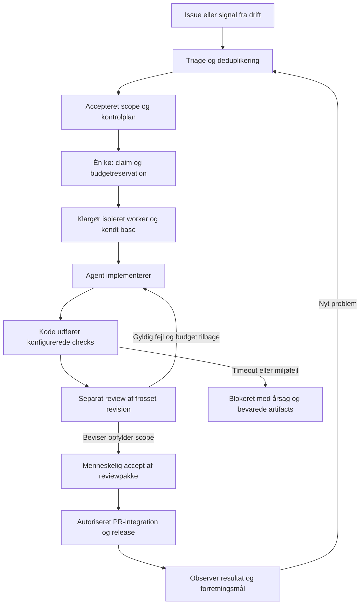

# Viderebygning af den valgfrie runtime

**Gældende byggeretning, 24. september 2026:** [én VPS-/lokalpakke på Machinist med fælles dashboard](platform.md) til software, security og valgfrie Defense-workflows. Den portable metode kan fortsat bruges alene. Archon er fravalgt. [Machinist-gennemgangen](machinist-review.md) beskriver aktuelle muligheder og integrationshuller; [fundamentgennemgangen](foundation-review.md) sammenligner de øvrige kilder.

Dette dokument er teknisk baggrund. Start med én Machinist-controller, én worker og ét pilotrepo. Genbrug dens UI og kvalificér vores metode, harness-wrappers og isolationsgrænse. Den eksisterende Node/SQLite-prototype og dens [syntetisk afprøvede adaptere](worker-integrations.md) bevares indtil erstatningen er bevist; de må ikke samtidig eje aktive jobs. [Arkitekturen](architecture.md) beskriver den nuværende kode, ikke en gennemført migration. Andre cloudprofiler nedenfor er alternativer, ikke parallelle byggeprojekter.

Vertical slices, separat review og [de fem værdimålinger](value.md#start-her-fem-målepunkter-og-en-scorer) bevares. Første driftsprofil ændrer ikke projektets merge-/deploymandat, og flere agenter må aldrig eje samme jobtilstand.

## Den samlede arbejdsgang

**Design før større ændringer:** udfyld fire korte punkter i [reviewpakken](../templates/review-packet.md): behov/succesmål, berørte systemgrænser, vigtigste kodekontrakter og første afprøvelige del. Undersøg eksisterende kode og markér væsentlige, usikre valg. Omfanget følger konsekvens og usikkerhed. Tydelige små rettelser kan bruge det eksisterende scope direkte. Saml relevante beslutninger; fire perspektiver medfører ikke fire obligatoriske godkendelser eller nye agenter.

**Vertical slices er en styrende udviklingsregel:** byg én lille, observerbar adfærd gennem de nødvendige lag, afprøv den og udvid derefter. Udviklingen må ikke opdeles i hele databasen → hele backend → hele frontend med integration til sidst. Nødvendigt grundarbejde holdes afgrænset og knyttet til den næste fungerende slice. En CLI, API eller sikkerhedsrettelse behøver ikke en UI; små rettelser kan være én slice.

**Før næste slice:** den aktuelle datavej skal virke, relevante fejl-/regressionsprøver skal være afklaret, og bevis, revision og næste skridt gemmes i reviewpakken. Skeln mellem en tidlig prøve med mocks og den rigtige integration. Agenten fortsætter gennem accepteret scope uden en menneskelig godkendelse for hver slice. Først når hele scope er opfyldt, kan opgaven afleveres som færdig.

Eksempel fra factoryen: start med at kunne køre én forberedt opgave gennem den kvalificerede worker og se dens faktiske status. Udvid derefter med fejl/stop og til sidst krævede beviser frem til review. Hver del afprøves gennem de relevante eksisterende lag og bevarer de gældende stop- og acceptgrænser; ingen del omgår dem for at blive hurtigere færdig. Dette er en byggeorden, ikke udførte pilotresultater.

Implementering kan bruge Codex, Cursor eller en anden egnet harness. Security kan tilføje en specialist til samme pipeline. Små rettelser behøver ikke en separat planner-agent. Tests og venten på kendte eksterne tilstande udføres af kode. En agent tilkaldes, når noget kræver vurdering eller reparation.

## Kvalificér den valgte Machinist-motor

**Machinist er valgt som fundament**, fordi den nyere version allerede har kontrolplan, GUI, workflows, godkendelser og VPS-drift. Vores arbejde er en færdigsamlet, kvalificeret pakke ovenpå. **Pi er en harness-kandidat**; motor og harness løser forskellige opgaver. Pi’s tidligere RPC-prøve er syntetisk og beviser ikke en Machinist-integration. Første prøve bruger ét syntetisk repo uden modelbetaling eller produktionsadgang; derefter følger en rigtig appopgave.

| Afprøvning | Bestået når |
| --- | --- |
| Et job gennem motoren | Fast repo/kommando, præcis revision, struktureret resultat og brugbar log kan følges fra start til slut |
| Dublet og afbrudt worker | Samme opgave kan ikke få to writers; en mistet lease giver ikke skjult dobbeltudførelse |
| Fejl, stop og genstart | Timeout og cancellation stopper procestræet; et restart nulstiller ikke reparationsbudgettet |
| Reviewgrænse | Exit 0 bliver ikke automatisk accept; reviewer vurderer præcis den leverede revision |
| Portabilitet | Samme workflow kan bruge en testadapter og derefter Pi eller Codex uden at ændre kundens scope/accept |
| Vedligehold | Adapteren erstatter mere kode, end den tilfører; ingen anden scheduler ejer samme aktive levering |

Den [aktuelle gennemgang](machinist-review.md) og [prøveprotokol](proof.md) skelner mellem upstreamtests, en lokal syntetisk procesprøve og den stadig manglende Arcitai-/modelpilot. Brug workflows: rå commands kan blive genkørt efter mistet lease, og indbyggede triggers starter endnu commands. Gem eksport og definér migrationen, før en aktiv kø flyttes. Machinist bliver eneste ejer af jobtilstand.

## Eksempler på deploymentprofiler

| Profil | Controller og worker | Inference | Første brug / grænse |
| --- | --- | --- | --- |
| VPS/lokal standard under opbygning | Machinist-controller/GUI og én afgrænset worker på dedikeret Linux-miljø | Valgt modeladgang; lokal inference efter kvalifikation | Se [de prioriterede slices](platform.md). Pakning, sikker jobgrænse og samlet onboarding skal bygges |
| Hurtig managed pilot | Codex Cloud styrer sin egen opgave; manuel forbindelse til vores review/metode | Tjenestens tilgængelige modeller | Hurtig start uden egen server. Konto/adgang skal prøves; ikke vores automatiske issue-pipeline |
| Egen styring med åben worker | Eksisterende Node/SQLite-controller på lille VM; Pi i Daytona-sandbox pr. job | Valgt ekstern API; Kastanje/EU efter kvalifikation | Pi-image, fjernprotokol, artifact-import og recovery skal bygges. UI via privat SSH-portforward |
| Andre managed alternativer | Cursor Cloud Agent eller Agents API med hosted sandbox | Den valgte tjenestes muligheder | Cursor ved færdig computer-use; Agents API ved eget dashboard med OpenAI-harness. Særskilt adgang/afregning; vælg én relevant integration |
| Lokal | Loopback-UI; dedikeret VM/arbejdsmiljø til worker | Lokal Ollama eller valgt ekstern rute | Z13-pilot senere. Mål RAM, GPU, kontekst og stabilitet først |

De konkrete primærkilder og prisgrænser står i [cloudguiden](cloud-setup.md). Ingen profil er endnu afprøvet som en komplet cloudleverance. Cloud betyder ikke én samlet tjeneste: controller, arbejdsmiljø og model har hver sin livscyklus og afregning.

Ingen profil kræver GitHub Actions. Repository-checks kan køre i workerens testmiljø. Hvis projektet allerede bruger ekstern CI, læses dens resultater også. En ny issue starter ikke automatisk en dyr agent: den gennemgår deduplikering, aktør-/repo-kontrol, scope og capability/budget-check, før den kan claimes.

Egen cloud kræver ikke en GPU, når inference er ekstern. Lokal runtime betyder ikke lokal inference. En lokal model gør heller ikke browseropslag, GitHub, logs og backups lokale. EU-løftet kræver kontrol af hele den valgte datavej; se [value.md](value.md).

### Hvis en egen fjernprofil behøves: gennemgående dele

1. **Forberedt job → rigtig fjernstatus → reviewpakke:** den mindste Pi/Daytona-adapter, nødvendigt image, kendt base/revision, afgrænset adgang, én writer, timeout, stop og bevarede artifacts. Prøv med syntetisk provider først. En rigtig modelkørsel er særskilt evidens.
2. **Afbryd og genoptag samme job:** gem provider-id, genfind faktisk tilstand, håndter crash og dobbelte events uden en ekstra writer. Efterprøv budgetgrænser og oprydning før betalt ubemandet drift; mistet kontakt er ukendt, ikke stoppet.
3. **Godkendt issue → eksisterende jobvej → PR/review:** periodisk API-læsning med reconciliation først; signed webhook kan følge senere. Ingen ny scheduler og ingen automatisk merge.

Hver slice bruger de nødvendige lag og afprøves før næste. Den nuværende controller og worker deler filsystem/journal; en ekstern sandbox kan ikke kobles på med en URL alene. SQLite forbliver lokalt hos controlleren. Fjernadapteren skal transportere job og artifacts samt afstemme processtatus. Det lokale Codex-arbejde og cloudjobbet får separate branches/workspaces.

## Arbejdsmiljøets kontrakt

**Klargøring:** registrér repo, base-SHA, image/OS, toolversioner, dependency-lock, testdatabase og separate porte. Bekræft nødvendige værktøjer med en lille faktisk prøve. Skills er instruktioner, ikke bevis på browser-, computer- eller security-adgang.

**Afvikling:** worker får kun de nødvendige checkout-/testressourcer. Controller, evaluator, credentials til administration og skjulte evalfacit ligger uden for det område. Netværksadgang følger opgaven og den valgte provider. Checkout-isolation og OS-/credential-isolation vurderes særskilt.

**Stop og oprydning:** stop processen; indfang forbrug og artifacts; bevar commits/diff; deaktivér jobnøgler; verificér stop; frigiv først derefter writer. Fejl under indsamling skal være synlige. Indsamling må ikke medføre, at en nøgle kan bruge penge ubegrænset: udløb/providergrænse og en separat oprydningsmekanisme er nødvendige for ubemandet drift. Destroy må vente, hvis arbejdet ikke er bevaret. Unknown må ikke fortolkes som stopped.

**Økonomi:** brug en jobafgrænset providergrænse, hvor det understøttes, plus loft over tid, reparationer og samtidighed. Best-of-N reserverer et samlet budget for alle varianter, reviews og compute. Et lokalt tal i en JSON-fil er ikke et håndhævet finansielt loft. Hvis providerens spend-stop ikke kan efterprøves, skal ubemandet betalt kørsel forblive utilgængelig i den profil.

## Review, beviser og release

Vælg review efter **konsekvensen af ændringen**: brugeradfærd, auth/rettigheder, dataændringer, dependencies, deployment, agentinstruktioner og forbrug. Filantal alene afgør ikke risiko. Ukendt risiko giver en synlig afklaring, ikke automatisk lav risiko. Et lille projekt behøver normalt én separat reviewer; specialister tilføjes, når ændringens område kræver det.

En [reviewpakke](../templates/review-packet.md) samler behovet, basen, resultatets fulde SHA, før/efter, checks, review og pris. UI-beviser skal vise den relevante handling. Performancebeviser skal bruge samme workload, miljø og gentagelser. En sikkerhedsrettelse skal demonstrere, at den konkrete uønskede adfærd er stoppet, og at forventet adfærd fortsat virker. Manglende baseline beskrives ærligt.

Review vurderer også kodevalgene: placering af ansvar, afhængigheder, kontrakter og fejlhåndtering. Dokumentér væsentlige afvigelser fra det aftalte design. For en reproducerbar fejl skal den målrettede prøve fejle af den rigtige årsag før rettelsen og bestå efter; eksisterende regressionstests skal fortsat kunne bestå. Grønne checks og en evidensscore dokumenterer ikke alene, at koden er let at videreudvikle.

Tests skal svare til en godkendt kontrolplan. En ikke-tom liste af selvvalgte checks kan stadig være utilstrækkelig. v0.1 validerer importerede checkformater og revisioner; næste version skal også kontrollere **hvilke checks der kræves**, deres identitet og om de faktisk blev udført af verifieren. En agent må ikke sænke sin egen kontrolplan ved at redigere tests eller factory-policy.

Review, PR-merge, deployment og produktionsobservation har hver sin status. En integration/rebase kan ændre resultatet: kontroller den integrerede revision igen. En ekstern 5/5-score og et grønt screenshot kan supplere, men ikke erstatte, test af adgangskontrol eller vurdering af datamigrationer. Merge/deploy automatiseres først under en konkret, særskilt releasepolitik.

## Feedback uden en selvændrende produktionsmaskine

Løbende undersøgelser og driftsalarmer kan tilsluttes som **Defense-workflows på samme platform**, med egne rettigheder og private beviser. Det er valgfrit og kræver ikke en anden controller. Softwareforløbet modtager afgrænsede opgaver og leverer verificerede rettelser. Første driftsintegration læser få aftalte signaler: fejlrate, svartid og et relevant forretningsmål. Registrér baseline, release-SHA, observationsvindue og ansvarlig. Et signal bliver en deduplikeret sag med reproduktion og konsekvens; en 500-fejl er ikke automatisk et sikkerhedsfund. Rå kundelogs og sårbarheder bliver i godkendt privat scope. Rollback/produktionsændring kræver konkret handlingsmandat.

Saml nødvendige menneskelige beslutninger i [én lille oversigt](../templates/human-review.md), inklusive ældre uafsluttet arbejde og manglende datadækning. Efter pilotleverancer laves et manuelt tilbageblik: kom samme fejl igen efter en verificeret release, eller manglede der bevis for første fix? Automatisér kun dette, hvis gentagelsen er nyttig. Kendt status og venten indsamles af kode; modeller bruges til vurdering og diagnose.

Fejl i selve factoryen klassificeres: uklart scope, utilgængeligt værktøj, miljøfejl, implementeringsfejl, reviewfejl, kapacitets-/budgetstop eller regressionsfejl efter release. En foreslået prompt-/skillændring får en almindelig ændring i Git og en sammenlignelig evaluering, før den bruges til fremtidige jobs. Produktionsagenter må ikke ændre deres egne sikkerheds- eller acceptgrænser.

## Prioriterede næste opgaver

Disse er lokale opgaveudkast; de er ikke oprettet på GitHub.

| Prioritet / opgave | Leverance og konkret accept |
| --- | --- |
| **Før egen runtime-udbygning — Kvalificér den valgte installation** | Tilslut pakken til én eksisterende app med dens valgte agent og CI. Afprøv en lille opgave og review. Beskriv et konkret hul, før en ny adapter bygges. Brug [målekort](../templates/measurement-card.md); skeln mellem manuelle overdragelser, syntetiske prøver og reel integration |
| **P0 før reel workerafvikling — Et reproducerbart, afgrænset miljø** | Én workerprofil med rigtige checks, testdata og de nødvendige capabilities. Bevis at controllerdata/administrationsnøgler ikke kan nås, og at stop virker |
| **P0 før automatisk aflevering — Luk kvalitetssløjfen** | Implementering → konfigurerede checks → separat review → højst to reparationer → reviewpakke eller præcis blocker. Stale head, manglende check og ændret policy afvises. Manuel review bruges indtil da |
| **P0 før betalt ubemandet brug — Forbrug og recovery** | Providerens stop efterprøves; jobs kan genstartes uden dublet, tabte artifacts eller nulstillet budget. Ukendt forbrug forbliver ukendt |
| **P1 — GitHub-pipeline og synligt forbrug** | Pagination/reconciliation, issue/PR-identitet, konkret aktørkontrol, versionsspor og automatisk usage, hvor API giver det. Én ejer af eventrouting |
| **P1 — Tre rigtige Kastanje-opgaver** | En bug, en mindre forbedring og en afgrænset security-rettelse; mindst én bygger videre på tidligere leveret kode. Registrér omarbejde, regressioner, reviewventetid og al mennesketid. Brug [prøven med et senere krav](value.md#kan-vi-ændre-det-igen), og vælg derefter ét gentaget trin at automatisere |
| **P2 — Drift og begrænset parallelitet** | Først read-only releasefeedback. Derefter separate workspaces og integrationskø, hvis ventetid og økonomi begrunder flere writers |
| **Før produktudgivelse — Machinist som eneste motor** | Afprøv scenarierne ovenfor, versionsfastlås, kontrollér backup/restore og erstat eksisterende jobstyring. Ingen parallel kø som ekstra lag |

Kastanje som inference-produkt og Z13 som hardwarepilot kan testes uafhængigt. Bachelorens eksisterende afgrænsning ændres ikke her. Kundetilbuddet bør være én fungerende arbejdsgang med dokumenteret kvalitet og ejerskab, ikke et løfte om fuld autonomi eller et bestemt modelabonnement.
