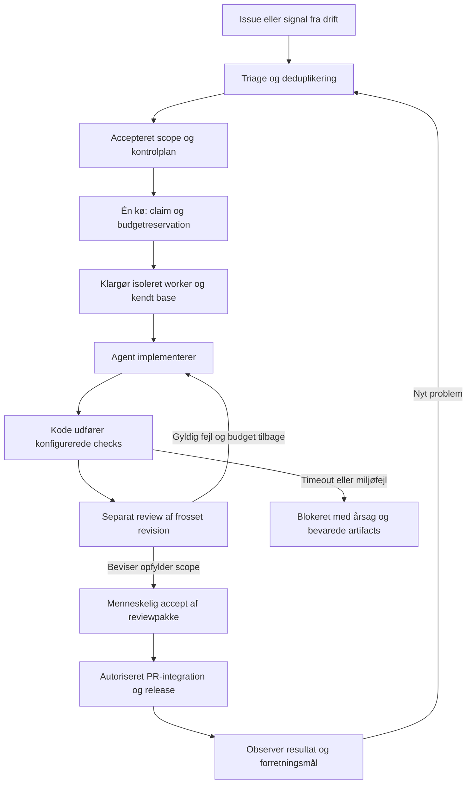

# Fra starter til en factory, der kan arbejde uden opsyn

Beslutningsforslag efter [videogennemgangen](video-audit.md), suppleret med [Pi-research](pi-research.md) 22. september 2026. Dette er **næste versions kontrakt og prioritering**, ikke funktioner, som v0.1 allerede har. [Arkitekturen](architecture.md) beskriver den kørende kode.

Den mindste fornuftige løsning er **én controller, én worker og ét pilotrepo**. GitHub er indgangen til arbejdet og hjem for kode/PR. Runtime ejer kørsler, låse og stop. Dashboardet viser denne tilstand. Skills beskriver faglig metode; de skal ikke være eneste håndhævelse af budgetter, checks eller adgang.

## Den samlede arbejdsgang

Implementering kan bruge Codex, Cursor eller en anden egnet harness. Security kan tilføje en specialist til samme pipeline. Små rettelser behøver ikke en separat planner-agent. Tests og venten på kendte eksterne tilstande udføres af kode. En agent tilkaldes, når noget kræver vurdering eller reparation.

## Før vi vælger en permanent motor

Afprøv **Machinist først som controller-kandidat**, med Sandcastle som alternativ byggesten, hvis hovedbehovet er agent-/sandboxadaptere. **Pi er nu første harness-kandidat**; controller og harness løser forskellige opgaver. Pi’s syntetiske RPC-prøve er gennemført, men erstatter ikke controller-/recovery-prøven nedenfor. Begræns denne til ét syntetisk repo, ingen providerbetaling og ingen produktionsadgang i første fase.

| Afprøvning | Bestået når |
| --- | --- |
| Et job gennem motoren | Fast repo/kommando, præcis revision, struktureret resultat og brugbar log kan følges fra start til slut |
| Dublet og afbrudt worker | Samme opgave kan ikke få to writers; en mistet lease giver ikke skjult dobbeltudførelse |
| Fejl, stop og genstart | Timeout og cancellation stopper procestræet; et restart nulstiller ikke reparationsbudgettet |
| Reviewgrænse | Exit 0 bliver ikke automatisk accept; reviewer vurderer præcis den leverede revision |
| Portabilitet | Samme workflow kan bruge en testadapter og derefter Pi eller Codex uden at ændre kundens scope/accept |
| Vedligehold | Adapteren erstatter mere kode, end den tilfører; ingen anden scheduler ejer samme aktive levering |

Kilden til kandidatens muligheder og begrænsninger står i [Machinist-afsnittet](video-audit.md#machinist-undersøg-før-vi-genopfinder-runtime). Vi har kun læst koden; denne afprøvning er **ikke udført**. Hvis kandidaten vælges, bliver dens runtime-status autoritativ. Arcitais UI kan vise den via en adapter; den eksisterende lokale forsøgsjournal må ikke konkurrere om jobclaim. Gem en eksport og definér migreringen, før en kø flyttes.

## Tre deploymentprofiler

| Profil | Controller og worker | Inference | Første brug |
| --- | --- | --- | --- |
| Lokal | Loopback-UI på egen maskine; dedikeret VM/arbejdsmiljø til worker | Lokal Ollama eller valgt ekstern rute | Z13 med syntetiske cases. Mål RAM, GPU, kontekst og stabilitet først |
| Egen cloud | Privat UI på en lille egen VM via SSH-tunnel; isoleret worker | Kastanje/EU eller anden valgt provider | Kastanje-pilot med én opgave ad gangen |
| Managed cloud | Eksisterende UI og eksplicit overdragelse til Cursor Cloud Agent | Providerens dokumenterede muligheder | Når managed browser/computer reducerer opsætningsarbejdet |

Ingen profil kræver GitHub Actions. Repository-checks kan køre i workerens testmiljø. Hvis projektet allerede bruger ekstern CI, læses dens resultater også. En ny issue starter ikke automatisk en dyr agent: den gennemgår deduplikering, aktør-/repo-kontrol, scope og capability/budget-check, før den kan claimes.

Egen cloud kræver ikke en GPU, når inference er ekstern. Lokal runtime betyder ikke lokal inference. En lokal model gør heller ikke browseropslag, GitHub, logs og backups lokale. EU-løftet kræver kontrol af hele den valgte datavej; se [value.md](value.md).

## Arbejdsmiljøets kontrakt

**Klargøring:** registrér repo, base-SHA, image/OS, toolversioner, dependency-lock, testdatabase og separate porte. Bekræft nødvendige værktøjer med en lille faktisk prøve. Skills er instruktioner, ikke bevis på browser-, computer- eller security-adgang.

**Afvikling:** worker får kun de nødvendige checkout-/testressourcer. Controller, evaluator, credentials til administration og skjulte evalfacit ligger uden for det område. Netværksadgang følger opgaven og den valgte provider. Checkout-isolation og OS-/credential-isolation vurderes særskilt.

**Stop og oprydning:** stop processen; indfang forbrug og artifacts; bevar commits/diff; deaktivér jobnøgler; verificér stop; frigiv først derefter writer. Fejl under indsamling skal være synlige. Indsamling må ikke medføre, at en nøgle kan bruge penge ubegrænset: udløb/providergrænse og en separat oprydningsmekanisme er nødvendige for ubemandet drift. Destroy må vente, hvis arbejdet ikke er bevaret. Unknown må ikke fortolkes som stopped.

**Økonomi:** brug en jobafgrænset providergrænse, hvor det understøttes, plus loft over tid, reparationer og samtidighed. Best-of-N reserverer et samlet budget for alle varianter, reviews og compute. Et lokalt tal i en JSON-fil er ikke et håndhævet finansielt loft. Hvis providerens spend-stop ikke kan efterprøves, skal ubemandet betalt kørsel forblive utilgængelig i den profil.

## Review, beviser og release

Vælg review efter **konsekvensen af ændringen**: brugeradfærd, auth/rettigheder, dataændringer, dependencies, deployment, agentinstruktioner og forbrug. Filantal alene afgør ikke risiko. Ukendt risiko giver en synlig afklaring, ikke automatisk lav risiko. Et lille projekt behøver normalt én separat reviewer; specialister tilføjes, når ændringens område kræver det.

En [reviewpakke](../templates/review-packet.md) samler behovet, basen, resultatets fulde SHA, før/efter, checks, review og pris. UI-beviser skal vise den relevante handling. Performancebeviser skal bruge samme workload, miljø og gentagelser. En sikkerhedsrettelse skal demonstrere, at den konkrete uønskede adfærd er stoppet, og at forventet adfærd fortsat virker. Manglende baseline beskrives ærligt.

Tests skal svare til en godkendt kontrolplan. En ikke-tom liste af selvvalgte checks kan stadig være utilstrækkelig. v0.1 validerer importerede checkformater og revisioner; næste version skal også kontrollere **hvilke checks der kræves**, deres identitet og om de faktisk blev udført af verifieren. En agent må ikke sænke sin egen kontrolplan ved at redigere tests eller factory-policy.

Review, PR-merge, deployment og produktionsobservation har hver sin status. En integration/rebase kan ændre resultatet: kontroller den integrerede revision igen. En ekstern 5/5-score og et grønt screenshot kan supplere, men ikke erstatte, test af adgangskontrol eller vurdering af datamigrationer. Merge/deploy automatiseres først under en konkret, særskilt releasepolitik.

## Feedback uden en selvændrende produktionsmaskine

Start efter en reel pilotrelease med read-only observation af få aftalte signaler: fejlrate, svartid og kundens valgte forretningsmål. Registrér baseline, release-SHA, observationsvindue og kontaktperson. Et signal bliver en deduplikeret opgave med reproduktion og konsekvens. Rå kundelogs og sårbarheder bliver i det godkendte private scope.

Fejl i selve factoryen klassificeres: uklart scope, utilgængeligt værktøj, miljøfejl, implementeringsfejl, reviewfejl, kapacitets-/budgetstop eller regressionsfejl efter release. En foreslået prompt-/skillændring får en almindelig ændring i Git og en sammenlignelig evaluering, før den bruges til fremtidige jobs. Produktionsagenter må ikke ændre deres egne sikkerheds- eller acceptgrænser.

## Prioriterede næste opgaver

Disse er lokale opgaveudkast; de er ikke oprettet på GitHub.

| Prioritet / opgave | Leverance og konkret accept |
| --- | --- |
| **P0 — Vælg én runtime gennem en afgrænset prøve** | Kør scenarierne ovenfor med en testadapter. Beslut genbrug eller fortsat lille egen motor; skriv begrundelse og kodeomfang |
| **P0 — Et reproducerbart, afgrænset miljø** | Én workerprofil med rigtige checks, testdata og capabilities. Bevis at controllerdata/administrationsnøgler ikke kan nås, og at stop virker |
| **P0 — Luk kvalitetssløjfen** | Implementering → konfigurerede checks → separat review → højst to reparationer → reviewpakke eller præcis blocker. Stale head, manglende check og ændret policy afvises |
| **P0 før betalt ubemandet brug — Forbrug og recovery** | Providerens stop efterprøves; jobs kan genstartes uden dublet, tabte artifacts eller nulstillet budget. Ukendt forbrug forbliver ukendt |
| **P1 — GitHub-pipeline og synligt forbrug** | Pagination/reconciliation, issue/PR-identitet, konkret aktørkontrol, versionsspor og automatisk usage, hvor API giver det. Én ejer af eventrouting |
| **P1 — Tre rigtige Kastanje-opgaver** | En bug, en mindre forbedring og en afgrænset security-rettelse. Samme dokumentationskrav og målt samlet mennesketid før/efter |
| **P2 — Drift og begrænset parallelitet** | Først read-only releasefeedback. Derefter separate workspaces og integrationskø, hvis ventetid og økonomi begrunder flere writers |

Kastanje som inference-produkt og Z13 som hardwarepilot kan testes uafhængigt. Bachelorens eksisterende afgrænsning ændres ikke her. Kundetilbuddet bør være én fungerende arbejdsgang med dokumenteret kvalitet og ejerskab, ikke et løfte om fuld autonomi eller et bestemt modelabonnement.
