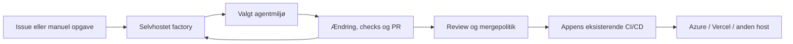

# En selvhostbar Software and Security Factory

**Mulig videreudvikling, 24. september 2026 — ikke implementeret endnu.** [Anbefalingen](product-experience.md) er først et installérbart kit med én afprøvet driftsprofil og en vurdering af eksisterende motor/UI. Beskrivelsen her afgrænser, hvad en egen platform kan blive. Archon er fravalgt. Byg en lille platform, hvor man tilslutter et repo, vælger et agentmiljø og får opgaver frem til en verificeret PR. Appens eksisterende CI/CD og hosting bliver stående. Den portable metodepakke kan også bruges alene.

## Hvor afgrænser Warp sig?

Warp er et platformprodukt i Early Access med opsætning, koordinering, agentkørsler og målinger. [Oversigt](https://docs.warp.dev/factories/). Deres normale arbejdsflow ender i en PR med beviser til menneskelig handoff. Spec-godkendelse og spørgsmål er workflowpolitik; mergekrav håndhæves gennem repoets rettigheder og branchregler. [Sådan virker flowet](https://docs.warp.dev/factories/how-factories-work/).

**Vores slutning:** Den grænse gør det muligt at arbejde med apps, der deployes til eksempelvis Azure eller Vercel, uden at factoryen implementerer en separat hostingplatform. Det er en arkitektonisk slutning, ikke en påstand om, at vi har testet alle kombinationer hos Warp. Har opgaven brug for preview, private testservices eller deploymentværktøjer, kræver de stadig konkret adgang og konfiguration.

## Tre ting, der kan ligge forskellige steder

| Del | Eksempel | Ansvar |
| --- | --- | --- |
| **Factory-platformen** | Egen maskine eller en lille server | Opsætning, jobstatus, routing, review, adgang, beviser og målinger |
| **Agentens arbejdsmiljø** | Isoleret lokal worker, egen VM eller valgt cloudtjeneste | Checkout, agent/harness, filer, værktøjer, testdata og tests. Inference vælges særskilt |
| **Kundens app** | Eksisterende Azure-, Vercel- eller anden installation | Produktion, appens data og eksisterende deployment-/rollbackpolitik |

Factory-platformen behøver ikke en GPU, når modellen kører andetsteds. En model på egen maskine kan være en profil. Agent-, model- og workerunderstøttelse skal afprøves for den konkrete kombination.

## Hvad skal ind i appen?

| Factoryen håndterer | Projektet angiver eller beholder |
| --- | --- |
| Tilslut repo og læs issues/PR-status | Repo, branch og afgrænset Git-adgang |
| Start, følg og stop agentjob | Afprøvet workerprofil, agent/model og tilladte værktøjer |
| Reproducerbar opgave og verificering | Setup-/testkommandoer, testservices og forventede checks |
| Security og separat review | Risikokriterier, privat fundkanal og relevante specialister |
| Vis review, PR og eventuelle previewlinks | Eksisterende CI/CD, preview, merge og deploymentregler |
| Registrér tid, forsøg og kendt forbrug | Tilgængelige målekilder; ukendte tal forbliver ukendte |

Den første version behøver derfor ingen “vælg Azure/Vercel”-opsætning. Den kan læse checkstatus og links fra repoet. En agent må ændre deploymentkode som en almindelig reviewbar opgave; udførelsen i produktion følger stadig appens politik. Hvis hosting allerede bygger en preview ved PR eller deployer efter merge, bruges den integration.

## Sådan bør opsætningen opleves

**Start platformen → tilslut repo → vælg worker → kontrollér setup → send første opgave.**

Målet er en dokumenteret start med eksempelvis Docker Compose på egen maskine/server og en browserguide. Der findes endnu ingen sådan Compose-pakke eller wizard i repoet. Guiden skal kunne foreslå opsætning fra repoet, vise manglende adgang og afprøve checkkommandoerne. En manuel mulighed for usædvanlige stacks skal være tilgængelig. Secrets gemmes adskilt fra appens kode og agentens skriveområde.

Provideruafhængighed opnås gennem få konkrete adaptere med samme krav til start, status, stop og aflevering. Ét abonnement bliver ikke automatisk en cloud-API, og adgang til en model beviser ikke browser- eller sandboxfunktioner. Start med én afprøvet profil og test udskifteligheden med en anden bagefter.

## Byg i tre vertical slices

1. **Repo → fungerende testmiljø.** Brugeren tilslutter ét repo, vælger den første workerprofil og får et rigtigt checkout med bestået setup/check. Konfiguration gemmes, manglende adgang vises, og eksisterende appfiler bevares. Start med én operatør og privat/lokal adgang; offentlig fjernadgang kræver autentificering.
2. **Én opgave → verificeret PR.** Manuel start gennem hele vejen: scope, isoleret worker, ændring, tests, security-vurdering, separat review og PR. Vis status, beviser, pris/tid hvor kendt og et faktisk fungerende stop. En rigtig Kastanje-opgave er pilot; syntetiske prøver er supplerende bevis.
3. **Issue-trigger → samme leveringsvej.** Tilføj én trigger, deduplikering og genoptagelse efter afbrydelse. Ukendt workerstatus må ikke skabe en ekstra writer. Tilknyt checks til den faktiske PR-revision, og afprøv budget-/stopgrænser før ubemandet betalt brug. GitHub og dashboardet viser samme job og resultat.

Hver slice gennemføres og afprøves, før næste udvides. Den nuværende Node/SQLite-starter giver UI, journal, scopes og lokale adaptere; GitHub-adgangen er primært læsning. Wizard, sikker skriveadgang, automatisk PR-aflevering, fjernworkerprotokol og komplet recovery er reelt arbejde, der stadig mangler. [Aktuel arkitektur](architecture.md).

**Vigtig forskel til Warp:** vores mål er, at også koordinering og journal kan drives selvstændigt. Warps selvhosting flytter udførelsen, mens Warp fortsat driver koordinering og lagrer run-data. [Deres infrastrukturgrænse](https://docs.warp.dev/factories/infrastructure-and-security/).

Løbende produktionsovervågning og incidentarbejde tilhører den separate [Defense Factory](adoption.md#produktnavn-og-grænsen-til-defense-factory), som kan aflevere fund til rettelse her.
