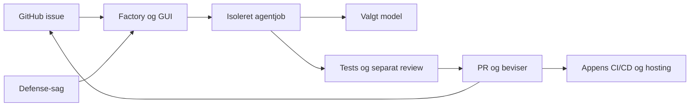

# Én factory, ét dashboard, flere arbejdsforløb

**Valgt byggeretning · 24. september 2026:** Genbrug Machinist som fundament for en færdigsamlet Arcitai-pakke. Installér, forbind repo/model, afprøv miljøet og send første issue til review. VPS er første driftsprofil; samme Linux-baserede pakke skal kunne køre lokalt. Archon er fravalgt.

**Status:** Vi har metode, seks skills og en lokal prototype. Machinists nyere motor og GUI er [undersøgt og lokalt testet](machinist-review.md). Den samlede Arcitai-installation, isolerede agentjobs og rigtige model-/apppilot mangler stadig.

## Hvad samler platformen?

| Arbejdsforløb | Fra behov til resultat |
| --- | --- |
| **Software** | Issue → vertical slices → tests og review → verificeret PR |
| **Security** | Undersøgelse → valideret fund → rettelse og bevis |
| **Defense og drift** | Signal/alarm → undersøgelse → forslag til indgreb eller en scoped softwareopgave → opfølgning |

Samme installation og dashboard; adgang, private beviser og tilladte handlinger følger arbejdsforløbet. Defense skal også kunne undersøge software bygget andetsteds. Et incident kan skyldes kode, drift eller sikkerhed. En HTTP 500-fejl er ikke i sig selv en sårbarhed. Første incidentprofil undersøger og foreslår; produktionsindgreb kræver eget mandat.

## Hvad følger med?

| Del | Standard i den første udgivelse |
| --- | --- |
| Factory og GUI | Machinists kontrolplan, worker og eksisterende GUI; Arcitai samler opsætningen og workflowpakken |
| Agentens computer | Separat jobcontainer på dedikeret vært; checkout, shell, filer, tests og browser ved behov |
| Agent og model | Kvalificér Codex-adapteren først og derefter Pi på samme kontrakt. Modeladgang vælges separat |
| Arbejdsflade | Opgaver, Review, Målinger og Opsætning; GitHub kan også bruges direkte |
| Levering | Branch, PR og beviser; appens eksisterende CI/CD og hosting bevares |
| Vedvarende drift | Start/stop, én aktiv worker, journal, recovery, opdatering og backup |
| Defense | Valgfrie undersøgelses-/incidentforløb på samme platform, med særskilt adgang til følsomme beviser |

Machinist skal eje kørsler, forsøg og stop; vores gamle Node-journal må ikke også starte jobs. GitHub ejer issues, PR’er og branchregler. Agentjob afskærmes fra controllerdisk, Docker-socket, private evaluatorressourcer og admin-/deploynøgler. Denne isolation er et integrationskrav; Machinists standardexecutor giver den ikke alene.

## Hvor kører den?

| Placering | Betydning |
| --- | --- |
| **Linux-VPS — standard** | Fortsætter, når din laptop er lukket. Dedikeret vært, persistent disk og ét projekt først |
| **Mac eller ROG Flow** | Samme pakke i et egnet Linux-miljø. Mac kræver VM/container-runtime; Windows kan bruge WSL2. Jobs afhænger af, at maskinen er vågen |
| **Cloudflare — senere profil** | Sandbox kan levere Linux-jobmiljøet, men kræver betalt plan/forbrug og tilpasning af storage; det er ingen gratis VPS |

En VPS behøver ingen GPU, når modellen kører andetsteds. Lokale modeller er et separat tilvalg, der skal afprøves på maskinen. Gratis Oracle-VM kan være en pilotmulighed med kapacitets-/driftsforbehold. [Priser og kildegrundlag](foundation-review.md#drift-og-pris).

## Så enkelt skal opsætningen være

**Start pakken → forbind repo/model → afprøv miljø → send første issue.**

Opsætningen finder projektets eksisterende instruktioner og checkkommandoer, foreslår standarder, gemmer credentials privat og afprøver adgangen. Manglende forudsætninger vises konkret. Brugeren skal ikke selv sammenkoble scripts og databaser.

Dashboardets vigtigste spørgsmål er: **Hvad kører? Hvad kræver mig? Hvad blev leveret? Hvad kostede det?** Genbrug Machinists flade først; tilføj Arcitai-felter og enkel opsætning, hvor piloten viser behov. Appens formål og brugerrejser kommer fra dens eksisterende brief/tests. Designretningen er et forslag, ikke et krav om at omskrive upstream-UI’en.

**Risiko er relativ:** vurder ændringens konsekvens i den konkrete app, eksponering, recovery og usikkerhed. Det styrer checks og specialistreview. Lille diff eller soloprojekt betyder ikke automatisk lav risiko. [Den konkrete regel og videonoter](relative-risk.md).

## Byg og bevis i tre vertical slices

1. **Repo → fungerende miljø i GUI.** Pak Machinist med vores workflow og isolerede jobmiljø. Kør én rigtig bruger-/API-prøve: baseline består, en relevant bevidst fejl opdages, manglende checks/forkert revision bliver ikke grønne. Prøv stop, mistet worker og restart uden to writers.
2. **Manuel issue → verificeret PR.** Agenten bygger ændringen, særskilt review kontrollerer revisionen, og den betroede leveringsdel åbner PR. Registrér tid, forbrug og menneskelig indsats. Afprøv Pi som alternativ før løftet om udskiftelighed.
3. **Issue → samme vej uden åben laptop.** Forbind GitHub-polling til workflowet med deduplikering og gemt budget/recovery. Machinists nuværende triggers starter commands; workflowkoblingen skal bygges. Automatisk start kommer efter den observerede første opgave. Merge/deploy følger appens politik.

**Næste selvstændige slice:** ét driftsignal → read-only undersøgelse → privat sag med beviser → forslag eller softwareissue → opfølgning på release. Brug samme motor. Google Cloud-demonstrationen er inspiration, ikke en færdig Machinist-connector.

**Udgivelsen er klar**, når en ren Linux-VM og et lokalt Linux-miljø kan gennemføre den vej uden manuel sammenkobling. En Docker-indpakket demoside er ikke nok. GUI-adgang starter privat; bekvem fjernadgang med login skal kvalificeres særskilt. Den portable metodepakke kan fortsat bruges alene.

Fabro, Mastra, Cole og Trycycle er [inspiration](foundation-review.md). [Machinist-gennemgangen](machinist-review.md) beskriver de konkrete integrationshuller. Den eksisterende starter bevares indtil erstatningen er bevist; to platforme skal ikke vedligeholdes permanent.
