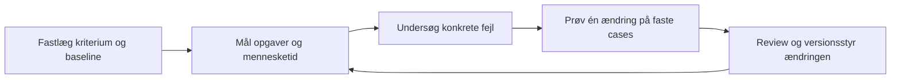

# Warp Scorers — det vi tager med

Undersøgt **24. september 2026**. Warp-mailen fra 22. september om Scorers er læst i den brugeråbnede iCloud-fane. Den præsenterer LLM-vurdering af agentarbejde som grundlag for løbende forbedring. Produktpåstandene er kontrolleret mod de offentlige kilder nedenfor. Ingen mailkopi, modtageroplysninger eller personlige trackinglinks følger med repositoryet.

**Vores valg: brug den eksisterende journal, én fokuseret scorer og de eksisterende evalcases.** Målemetoden skal kunne anvendes med Pi, Codex eller en anden worker og en valgfri evaluator. Den praktiske opskrift er indarbejdet i [guiden til dokumenteret værdi](value.md#start-her-fem-målepunkter-og-en-scorer). Der er ingen Warp-afhængighed eller ny tjeneste.

## Hvad dokumentationen faktisk beskriver

| Kilde, læst 24/9 | Hovedfund | Betydning for Arcitai |
| --- | --- | --- |
| [Configuring Scorers](https://docs.warp.dev/factories/measure-and-improve/scorers/) | En LLM klassificerer afsluttede runs efter egne kriterier. Labels har talværdier og en bestågrænse. Model og stikprøveandel vælges; enkeltkørsler kan vurderes manuelt. Ny scoring erstatter tidligere resultat fra samme scorer. | Brug bestået/fejlet/ukendt med evidens. Gem hver vurdering som en ny version i vores forsøgsgrundlag. |
| [Measure and improve](https://docs.warp.dev/factories/measure-and-improve/) | Driftsmålinger, scorere, benchmarks og forbedringsarbejde er forskellige funktioner. En baseline og undersøgelse af fejl kommer før sammenligning og adoption. Run-antal omfatter også målearbejde. | Skeln mellem kundeopgaver, forsøg og måling. Ændr én væsentlig faktor ad gangen. |
| [Benchmarks](https://docs.warp.dev/factories/benchmarks/) | Faste opgaver, kriterier og gentagelser sammenligner model-/runnerkonfigurationer. Inputs fastholdes for den enkelte undersøgelse. Omkostningen inkluderer scorerforbrug, men er et estimat; afbrudte benchmarks viser kun færdigscorede resultater. Dokumentationen siger, at sammenligning med tredjepartsharness endnu ikke er tilgængelig. | Behold vores egne portable cases og registrér også afbrudte/fejlede forsøg. Sammenlign kun matchede konfigurationer. |
| [Self-improvement](https://docs.warp.dev/factories/measure-and-improve/self-improvement/) | Gentagne scorerfejl kan udløse forslag til PR’er på app eller factory-definition. Den beskrevne planlagte udløsning er 25 ubehandlede fejl eller en ældste fejl på syv dage. Forslag kræver review. | Piloten bruger et manuelt tilbageblik; grænserne 25/syv dage kopieres ikke. |
| [Factory dashboard](https://docs.warp.dev/factories/factory-dashboard/) | Autonomi måles via fravær af menneskelige kode-pushes på merged PR’er; kommentarer, review og merge tæller ikke som push. PR-pris er et estimat, og gennemløbstid vises som median. | Registrér også faglig afklaring, arkitekturvalg, review, loginhjælp og reparation. PR-volumen alene er ikke kundeværdi. |
| [Factory definition syntax](https://docs.warp.dev/factories/factory-as-code/) | Scorerdefinition og benchmarkcases kan versionsstyres. Scorers er en klassifikation med labels, threshold, model og sampling. | En original Markdown-rubric og private evidensfiler er nok til vores første prøve. |

Dokumentationen er læst som beskrivelse af Warp-produktet, ikke som dokumentation for dets effektivitet hos vores kunder. Vi har ikke kørt en Warp Factory eller tilmeldt os Early Access.

## Kontrol af de konkrete eksempler

[warp-factory-examples](https://github.com/warpdotdev/warp-factory-examples/tree/84e7c952f1506c4bd2784d96fd40a6f4d6398cad), MIT, blev læst ved revision `84e7c952f1506c4bd2784d96fd40a6f4d6398cad`. Issue-to-PR-eksemplet har [task-compliance](https://github.com/warpdotdev/warp-factory-examples/blob/84e7c952f1506c4bd2784d96fd40a6f4d6398cad/examples/02-sdlc-issue-to-pr/scorers/task-compliance/scorer.md) og [review-quality](https://github.com/warpdotdev/warp-factory-examples/blob/84e7c952f1506c4bd2784d96fd40a6f4d6398cad/examples/02-sdlc-issue-to-pr/scorers/review-quality/scorer.md). Begge bruger klassifikationer med 0/0,5/1 og 25 % sampling; compliance-eksemplet slår forbedringsflowet til.

To forhold gør direkte kopiering uhensigtsmæssig: Eksempelfilerne mangler `name`, som den aktuelle dokumentation kræver. Review-eksemplet giver heller ikke en tydelig særskilt kategori til et korrekt review uden fund. Det er kildeforskelle og rubric-uklarhed, ikke en afprøvet fejl i Warps runtime. Vores egen rubric accepterer velunderbyggede konklusioner uden fund og markerer utilstrækkeligt grundlag som ukendt. En fejl skal aldrig opfindes for at få en bedre score.

## En lille forbedringssløjfe

Dette er vores tilpasning: Først en manuel pilot med review af alle leverancer. Den [første scorer](../evals/scorers/evidence-quality.md) vurderer kun bevisgrundlaget. Den kan senere udføres af en kvalificeret model. Kendte testresultater, tidsstempler og priser indsamles uden en LLM. Hverken en positiv klassifikation eller en høj gennemsnitsscore giver merge-/deployautoritet.

En scorer kan selv tage fejl. Sammenlign derfor dens vurderinger med en persons selvstændige læsning af samme materiale, bevar uenigheder og kontrollér særligt falske godkendelser. Kriterierne må ikke lempes for at få en kandidatmodel til at vinde. En ukendt vurdering, en vurdering der ikke blev udført og en observeret fejl er forskellige tilstande.

I en senere UI-version bør **Resultater** have fem små felter: accepterede opgaver, samlet pris, mennesketid, gennemløbstid og fejl efter accept. Under dem kan én scorer vise bestået/fejlet/ukendt, antal vurderede ud af relevante runs og link til begrundelser. **Kræver dig** viser uenigheder og blokerede beslutninger. Ingen samlet “factory IQ” er nødvendig.

## Bachelor og status

Det aktuelle bachelorarbejde undersøger pålidelig selvstændighed, faglig afklaring før kode og den faktisk nødvendige arkitektindsats. Softwareudvikling og sikkerhedsarbejde efter release skal kunne vurderes hver for sig. Factory-guiden giver et forslag til måleprotokol for dette; bachelorens spørgsmål, afgrænsning og rapportfiler ændres ikke her.

Kildelæsningen har resulteret i en udvidet værdiguide, en original scorer-rubric og et [kort målekort](../templates/measurement-card.md). Automatisk scoring, stikprøveudvælgelse, scorerhistorik og de nye dashboardfelter er **ikke implementeret**. Den eksisterende evalimport er uændret; den må ikke fodres med modelvurderinger som om de var uafhængigt verificerede resultater. Der er ikke udført nye forsøg eller målt en besparelse.
